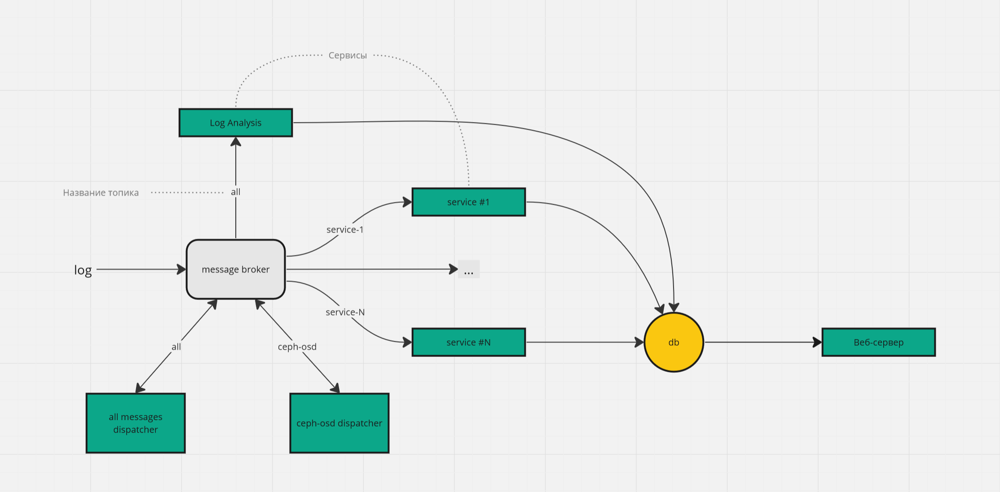

# Log Analysis
Проект предназначен для анализа логов и включает в себя набор сервисов.
Вся работа строится вокруг брокера сообщений. Сервисы слушают входящие сообщения по интересующему их топику, после чего обрабатывают их и сообщают о результатах обработки (например, сохраняют в базу данных).
Такая архитектура позволяет легко добавлять новые сервисы, не меняя уже существующий процесс обработки.

На текущий момент разработаны следующие сервисы:
- Диспетчер всех сообщений. Обрабатывает все сообщения, парсит в соответствии с заданной структурой лога и отправляет "очищенный" лог обратно в брокер сообщений
- Диспетчер ceph-osd. Работает аналогично диспетчеру всех сообщений
- Анализатор логов. Анализирует все логи, определяет их аномальность

Также был разработан набор модулей для создания сервисов, наиболее важным из которых является pipeline.
Конвейеры обработки данных (pipelines) состоят из более мелких частей -- пайп (pipes). Пайпы выстраиваются в цепочку, и образуется пайплан. 
Например, конвейер сначала разбивает данные на токены, удаляет знаки препинания, приводит все символы к нижнему регистру, потом отправляет результат в модель для анализа, получает результат и возвращает его вызывающему коду. 
Так как модели могут потреблять много ресурсов, они не встраиваются напрямую в пайпы, а работают в отдельном процессе, с которым можно установить соединение (например, через сокет). Таким образом, часть конвейера может выполняться там же, где был получен запрос на обработку, а часть -- на удалённой машине или в другом процессе.
